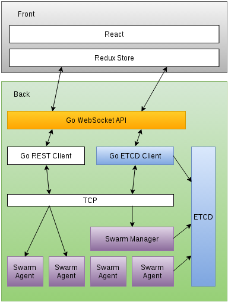

docker-commander
=====
A GUI to manage Docker

## Some info
* Project structure is defined like [here](https://github.com/golang/go/wiki/GithubCodeLayout):
* We're using [gin-gonic](https://github.com/gin-gonic/gin)
* We'll use [Docker Swarm](https://github.com/docker/swarm) probably and / or Ansible.

## Running Tests

### Mock tests
```bash
# With npm
npm test

# Without npm
go test `go list ./... | grep -v tests`
```

### Integration tests
Requires some config like an ETCD local installation, Swarm Manager and Swarm Agents. Can be easily achieved via ansible playbooks included.

```bash
# With npm
npm run test-integration

# Without npm
go test ./tests/integration/...
```

# Architecture



## Requirements
Requirements file for the MVP project can be found on [REQUIREMENTS.md](REQUIREMENTS.md)

## Gin Gonic Server

### etcd piece

Maintains state of the app and connected Swarm agents in cluster

* Watch 2 events:
  * New Agent in cluster: Emits `new-agent` event in server
  * Agent down in cluster: Emits `kill-agent` event in server

### REST Client

Will be used by server to make REST connections to Swarm Agents and Manager and return JSON info "as is" back to front via web-socket.

### Socket API

An API via socket layer to communicate real-time with front. Because it's bi-directional it is described as follows:


#### Client->Server
  * `cluster`: Returns a json with the entire cluster state. Mainly used when a client has just connected to the app
  * `agent:containers`: Replicates `GET /containers/json`. Needs image IP and optional parameters like in [Docker API](https://docs.docker.com/engine/reference/api/docker_remote_api_v1.22/#list-volumes)
  * `agent:images`: Replicates `GET /images/json`

#### Server->Client
  * `new-agent`: When a new Swarm Agent has joined the cluster
  * `kill-agent`: When an already existing Swarm Agent has left the cluster

## Front (React+Redux)
TODO
